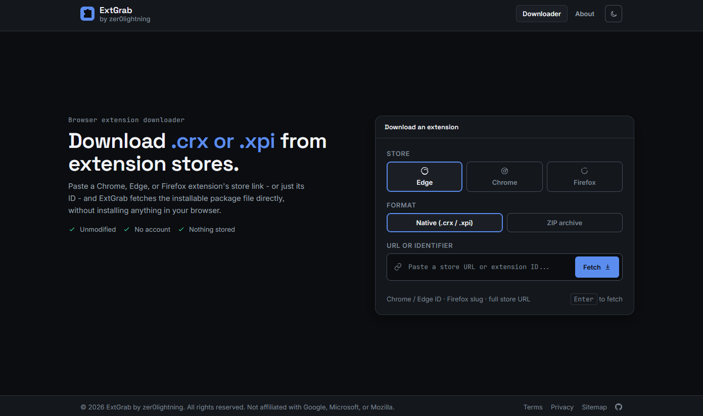

# ExtGrab - Browser Extension Downloader

A Cloudflare Worker that downloads Chrome, Edge, and Firefox extensions from their respective externsion marketplace.

Paste a store URL or an extension ID, and ExtGrab downloads raw `.crx` or `.xpi` file, optionally converted to a plain `.zip`.


## Screenshot

Live Demo: http://extgrab.threatstitch.com/

## Features

- **Three stores, one tool** - Chrome Web Store, Microsoft Edge Add-ons, and Mozilla Add-ons (AMO)
- **Store auto-detection** - paste a store URL and the right store is selected automatically
- **Native or ZIP** - download the original `.crx`/`.xpi`, or a plain `.zip` with the CRX header stripped off
- **Descriptive filenames** - reads the package's own `manifest.json` to name the file `<extension>-<version>-<id>.<ext>` instead of just the raw ID
- **Unmodified packages** - files are streamed through as-is; nothing is repackaged or altered
- **No accounts, no storage** - nothing is logged beyond what's needed to serve the request, and no packages are retained
- **Light/dark theme**, keyboard-friendly, and reasonably accessible (skip link, `aria-live` status, visible focus states)
- **SEO-ready** - `robots.txt`, `sitemap.xml`, canonical URLs, Open Graph/Twitter tags, and JSON-LD structured data
- **Hardened by default** - CSP, `X-Frame-Options`, `X-Content-Type-Options`, `Referrer-Policy`, `Permissions-Policy`, and HSTS on every response

Runs entirely on Cloudflare's edge - no origin server, database, or build step. It's one JavaScript file.

## Routes

| Route | Method | Description |
|---|---|---|
| `/` | GET | The app (downloader UI + About tab) |
| `/terms` | GET | Terms of use |
| `/privacy` | GET | Privacy policy |
| `/robots.txt` | GET | Search engine crawl rules |
| `/sitemap.xml` | GET | XML sitemap |
| `/` | POST | Fetches and returns an extension package (see below) |

### `POST /` - download an extension

Accepts either `application/json` or `multipart/form-data`.

```json
{
  "extensionId": "cjpalhdlnbpafiamejdnhcphjbkeiagm",
  "storeType": "chrome",
  "format": "native"
}
```

| Field | Values | Notes |
|---|---|---|
| `extensionId` | store URL, 32-character Chrome/Edge ID, or Firefox slug/GUID | required |
| `storeType` | `chrome`, `edge`, `firefox` | optional - inferred from a store URL automatically |
| `format` | `native`, `zip` | optional, defaults to `native` |

The response is the binary package with a `Content-Disposition` header set to a descriptive filename, or a JSON error object on failure. Files over 75MB skip manifest inspection and stream through directly with an ID-only filename.

## Deploying

No build step, no dependencies, no `wrangler.toml` required beyond the basics.

**Cloudflare dashboard**
1. Create a new Worker.
2. Paste the contents of `worker.js` into the editor.
3. Deploy.

**Wrangler CLI**
```bash
npm install -g wrangler
wrangler deploy worker.js --name extgrab
```

That's it - the Worker serves both the UI and the API from the same script.

## How it works

Each store exposes an update/download endpoint that Chrome, Edge, and Firefox themselves use to fetch extensions:

- **Chrome** - `clients2.google.com/service/update2/crx`
- **Edge** - `edge.microsoft.com/extensionwebstorebase/v1/crx`
- **Firefox** - `addons.mozilla.org/firefox/downloads/latest/…`

ExtGrab builds the appropriate request, follows the redirect to the actual package, and streams the response back. For the descriptive-filename and ZIP-conversion features, it reads the package's own `manifest.json` - `.crx` files are a small binary header glued onto a plain ZIP, so the Worker parses just enough of the ZIP central directory to locate that one entry and, if compressed, inflate it using the Web Compression Streams API (`DecompressionStream('deflate-raw')`) rather than a bundled library.

## Security

- Strict `Content-Security-Policy`, `X-Frame-Options: DENY`, `X-Content-Type-Options: nosniff`, `Referrer-Policy`, `Permissions-Policy`, and HSTS on every response
- Extension identifiers are validated against a safe character set before being used in URLs, filenames, or response headers
- Request bodies are size-capped before processing
- Internal error details are logged server-side only; clients get a generic message

## Legal

ExtGrab is an independent tool and is not affiliated with, endorsed by, or sponsored by Google, Microsoft, or Mozilla. Chrome, Edge, and Firefox are trademarks of their respective owners. You're responsible for complying with each store's terms of service and the license of whatever you download. See [`/terms`](/terms) and [`/privacy`](/privacy) for details.

## License

[MIT](LICENSE) © 2026 zer0lightning
